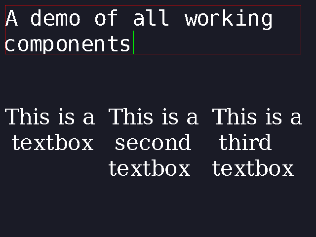

# Wayland GUI Toolkit
A demo framework for creating a Wayland GUI in C pixel by pixel

## Pre-requisites
- Linux Distribution with WayLand > 1.2
  - Tested for Ubuntu 22.04

## To Run Demo
1. Clone repository
2. Build demo file with `./build -t`
3. See [app_demo.c](app_demo.c) for how each component is used

## Screenshots

#### Notes
For educational purposes only, not intended for real world applications
